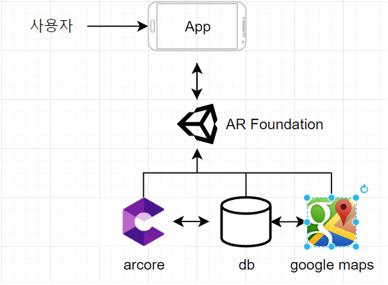

<h1>HelloWorld팀<h1>

# 프로젝트 Helloinu
## 개발목표

  인천대에 방문하는 사람들 중에 처음방문하거나 또는 인천대에 대한 정보를 추가적으로 알고 싶은 사람들 그 중에 고등학생(or 예비대학생)을 목표로 한 ar가이드 개발

 
  
## 개발범위
  

필요 dataset : 궁금할만 내용에 대한 정보 ex)학과,축제, 입시요강, 장학금, 식당, 주변 놀곳, 등록,성적,재수강에 대한 시스템 등등

SW & TOOL : mysql, arcore, unity, googlemaps
## 사용 시나리오
  App 실행 ->1.근처 건물,장소에 대한 간단한정보 2.메뉴 표시

1.건물들을 터치 ->해당 건물에 포함되어 있는 내용 제공 ex) 건물내부 구조도 ,포함되어있는 학과or 시설 -> 
1.1관심있는 학과 터치 -> 해당 학과에 대한 메뉴 표시 -> 학과에 대해 간단하게 animation 및 음성으로 설명후 입시요강 또는 성적관리, 뭘 배우는지 등 원하는 정보를 텍스트 및 이미지로 선택적 제공
1.2 시설 -> 시설에 대한 정보

2.메뉴터치-> (주변 장소,길찾기, 학교 시스템 등 건물에 포함되진 않았지만 궁금할만한 것들에 대한 리스트). 터치 -> 해당 정보 및 기능 제공
## 문제점
    

사용시나리오처럼 학과별,그 외 시설들의 데이터 제공을 위한 데이터 정리 
여러 지도들을 살펴보면 캠퍼스 내부에 대한 정보 미제공

## 아키텍처 미완
  

   
  
   
    

